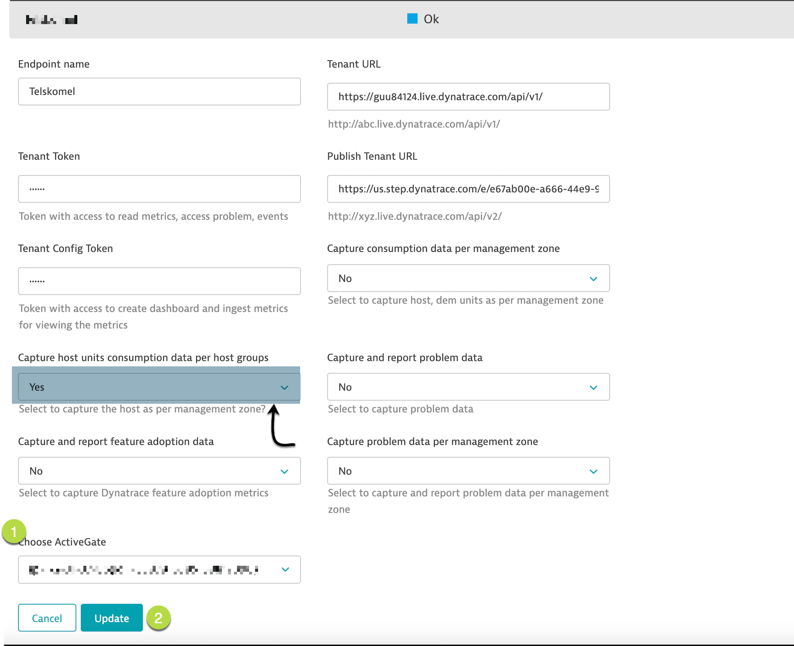
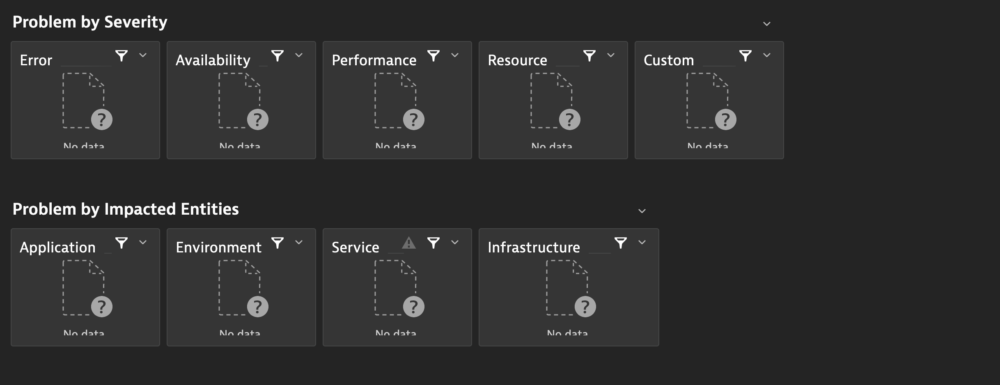
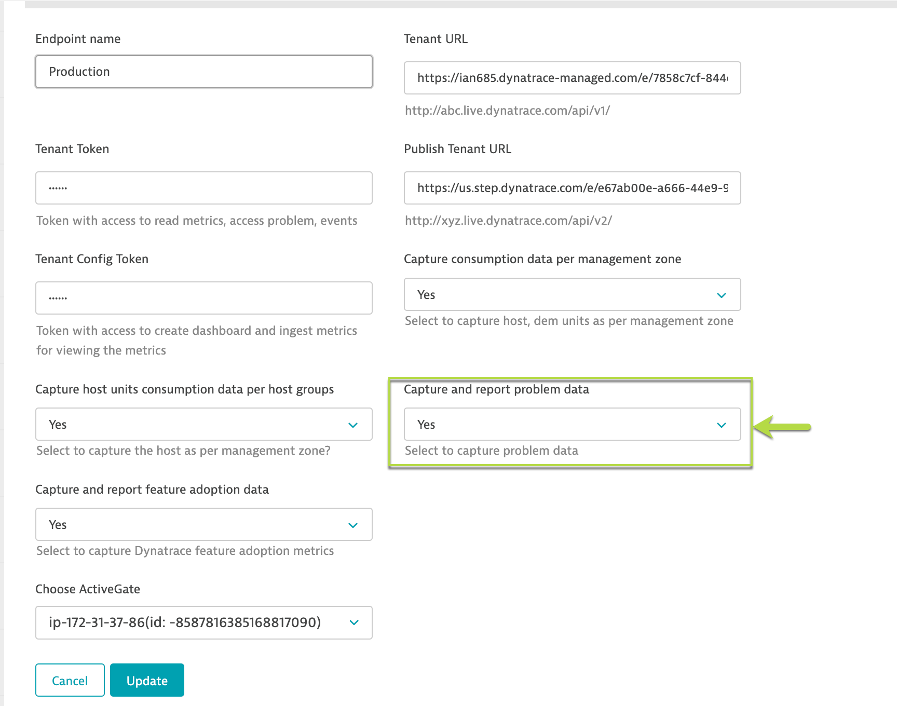
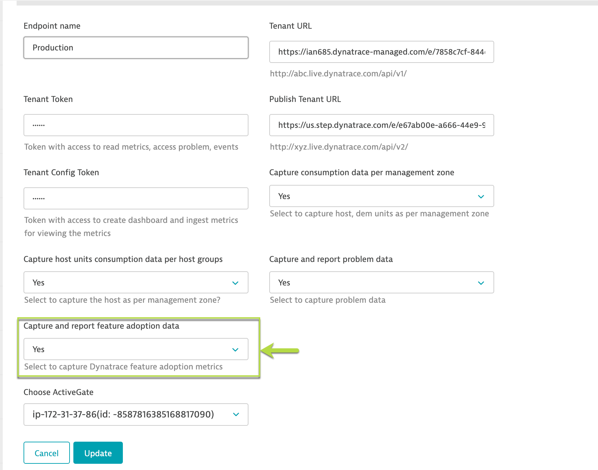
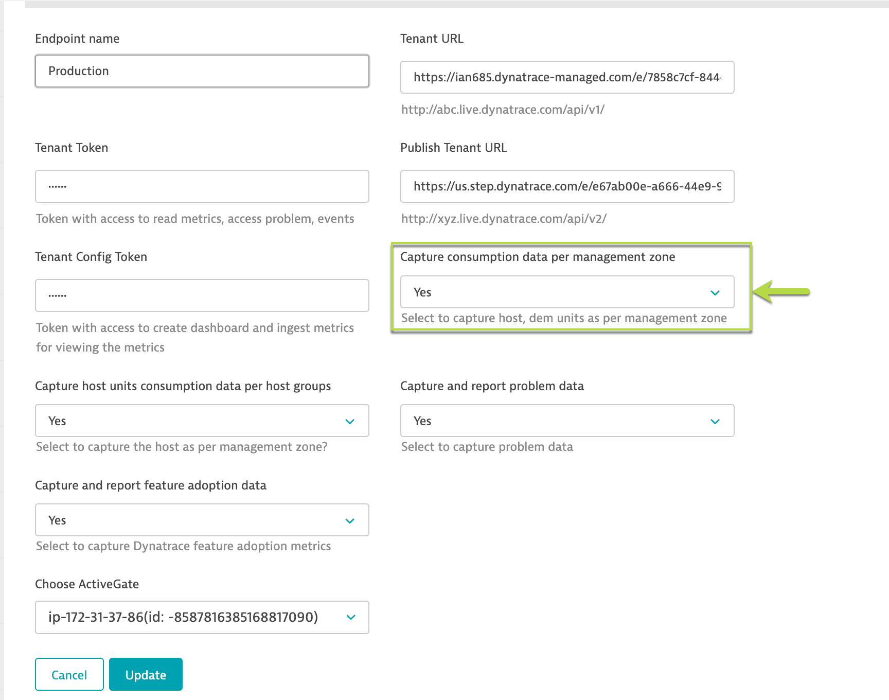

# Troubleshooting guide  

1. **Configuration error(Extension doesn't exist on given host)**  
  

**Error**: This error suggests the extension is not unzipped within the ActiveGate folder, hence, the tenant is not able to configure it.  

**Solution**: To fix the error, follow the steps as below:  
1. First upload the extension “custom.remote.python.insightify.zip” on the activeGate in “/opt/dynatrace/remotepluginmodule/plugin_deployment /” directory. (This is assuming you have the activeGate running from the default /opt/Dynatrace/gateway location)  
2. Further, navigate to ““/opt/dynatrace/remotepluginmodule/plugin_deployment/” directory and run unzip command as below:  
```  
cd /opt/dynatrace/remotepluginmodule/plugin_deployment  
unzip custom.remote.python.insightify.zip  
```   
This would unzip the file at the same location.  
 
3. Lastly, proceed on Settings > Insightify > Endpoint that we configured yesterday & select the activeGate followed by “Update”.  



2. **Missing data**  
  

In case you are not seeing data in a particular tile, there could be the following reasons:  
1. Tokens missing scope:  
Please refer to the **Getting started section** to verify that the tokens has required scope to pull API metrics. To make sure it would work, try running the API by accessing API swagger with the same token and see if that works.  

2. Configuration is not set to capture the data:  
Navigate to the endpoint within the extension and verify if you have enabled the extension to pull data from those tiles.  
For example, to pull problem data, please make sure that you have **Capture and report problem data** to **Yes**  
  

Similarly, to pull adoption data, please make sure that you have **Capture and report feature adoption data** to **Yes**  
  

Lastly, to pull data as per management zones, make sure that you have **Capture consumption data per consumption data** to **Yes**  
  

3. Granularity of data  
If the above two conditions are fulfilled and still you are not getting data, it is likely that the API call is not made internally by the extension. Please note the data is pulled periodically depending on the type of metrics.  

**For reference**:  
Data for **Problems** are pulled only **once per day**  
Data for **License consumption** is pulled **once every hour**  
Data for **Adoption feature metrics** is pulled **once every week**  

This is done to *limit* the DDU consumption as well as considering data would be more useful when pulled at the above said granulatrity.  
